# Generating-abnormal-images-on-high-voltage-transmission-lines
## Dị vật mắc trên lưới truyền tải
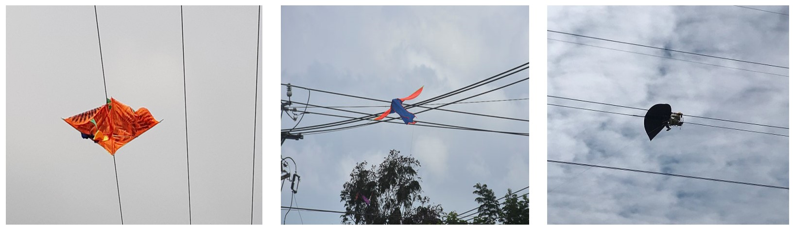

## Cách diện thủy tinh vỡ mất bát
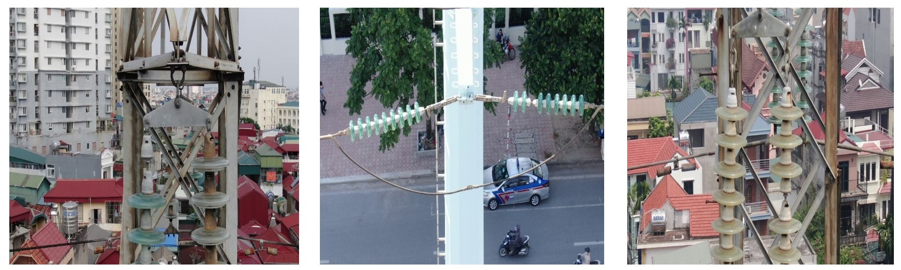

## Dây điện bị Corona
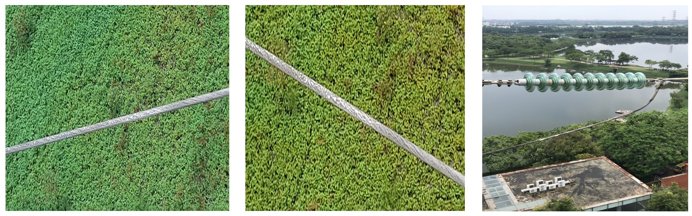

- Đối với bài toán nhận dạng đối tượng trong ảnh thì thuật toán học có giám sát đang là thuật toán cho kết quả chính xác cao nhất .
Vậy để thực hiện việc học có giám sát trước tiên ta phải quan tâm đến việc gán nhãn các đối tượng trong ảnh. Trong bài toán nhận
diện dị vật trên đường dây truyền tải điện này em đang sử dụng công cụ labelme để gán nhãn với kiểu gán là polygon để thuận tiện
cho thuật toán nhận dạng sau này.
-	Để sinh ảnh dị vật trên đường dây truyền tải điện ta cần một bức ảnh chụp thiết bị của đường dây truyền tải và ảnh dị vật loại bỏ nền mà mình muốn thêm vào :
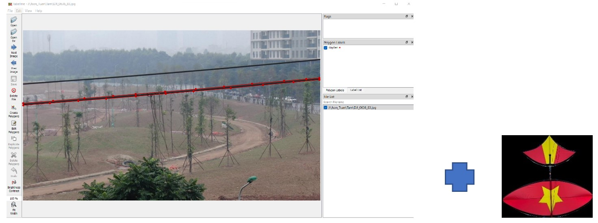

- Với việc sinh dị vật trên thiết bị của đường dây truyền tải điện ta hướng đến 2 mục tiêu chính :
  
  - Sinh ảnh sao cho thật nhất có thể (sinh dị vật đúng trên thiết bị truyền tải điện là dây điện và cột điện,cách điện , kích thước dị vật không lớn hoặc nhỏ quá so với đối tượng mình sinh lên).
  - Sinh được nhãn bo dị vật để ta không  phải gán lại nhãn dị vật sau sinh, điều này là rất quan trọng.

**Để dạt được mục tiêu thứ nhất:**

* B1. Từ vùng ảnh mà đối tượng được gán nhãn ở ví dụ này ta lấy là vùng ảnh dây điện ta chọn ngẫu nhiên 1 điểm O(x,y)  thuộc vùng ảnh đó.
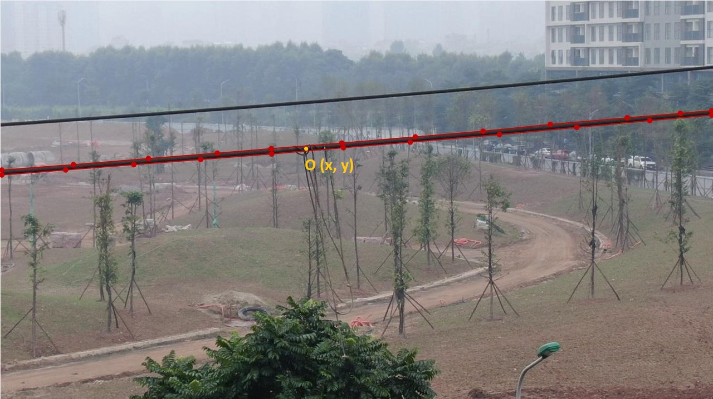

* B2. Bây giờ ta cần xác định vùng ảnh để ta Add ảnh dị vật lên ảnh gốc.
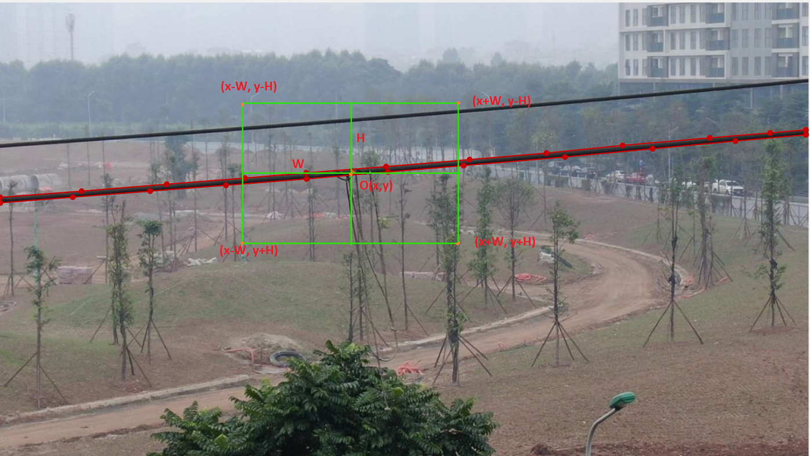

* B3. Sử dụng thuật toán Add 2 ảnh, resize và xoay ảnh dị vật sao cho dị vật nhìn tự nhiên nhất , ta thu được kết quả.
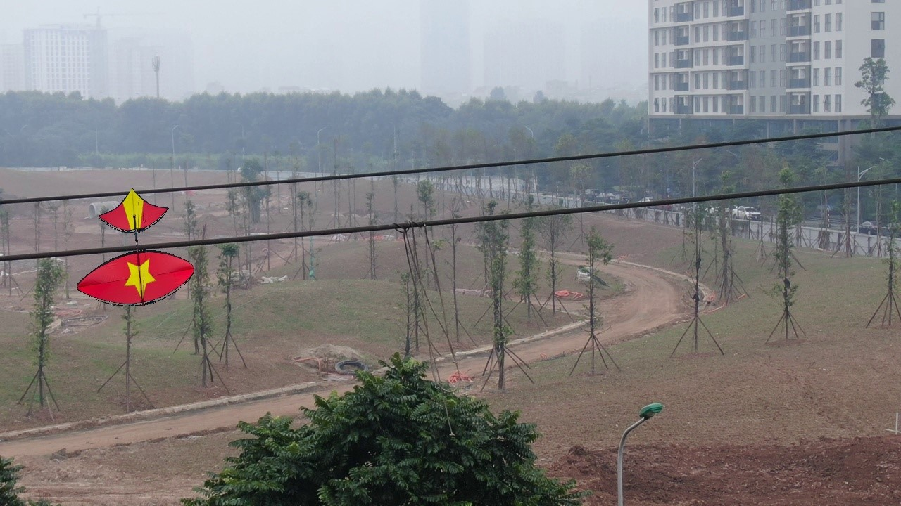

**Để đạt được mục tiêu thứ hai là sẽ tự động gán nhãn vùng dị vật khi sinh lên ảnh gốc:**

* B1
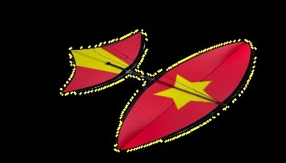

* B2
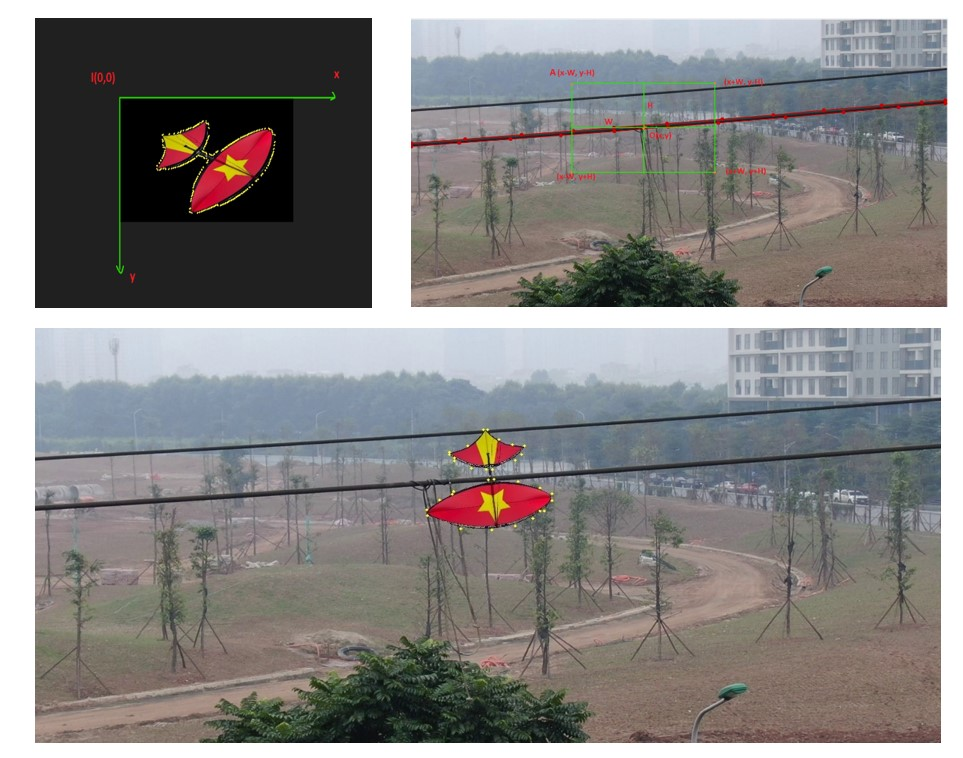

## Kết quả sinh ảnh cách điện thủy tinh vỡ mất bát
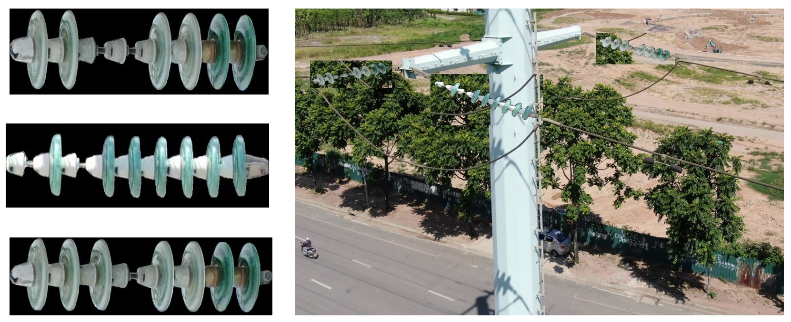

## Kết quả sinh ảnh dây điện bị corona
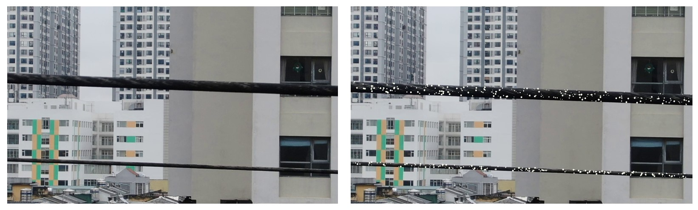

## Kết quả nhận diện và phất hiện đối tượng bất thường sau khi training với tập ảnh sinh
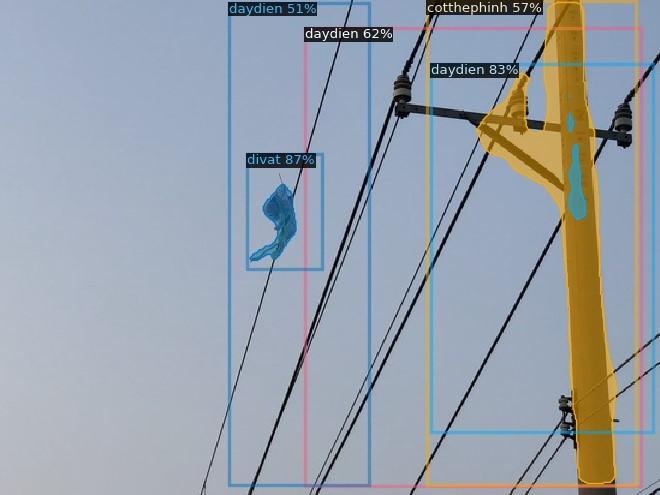
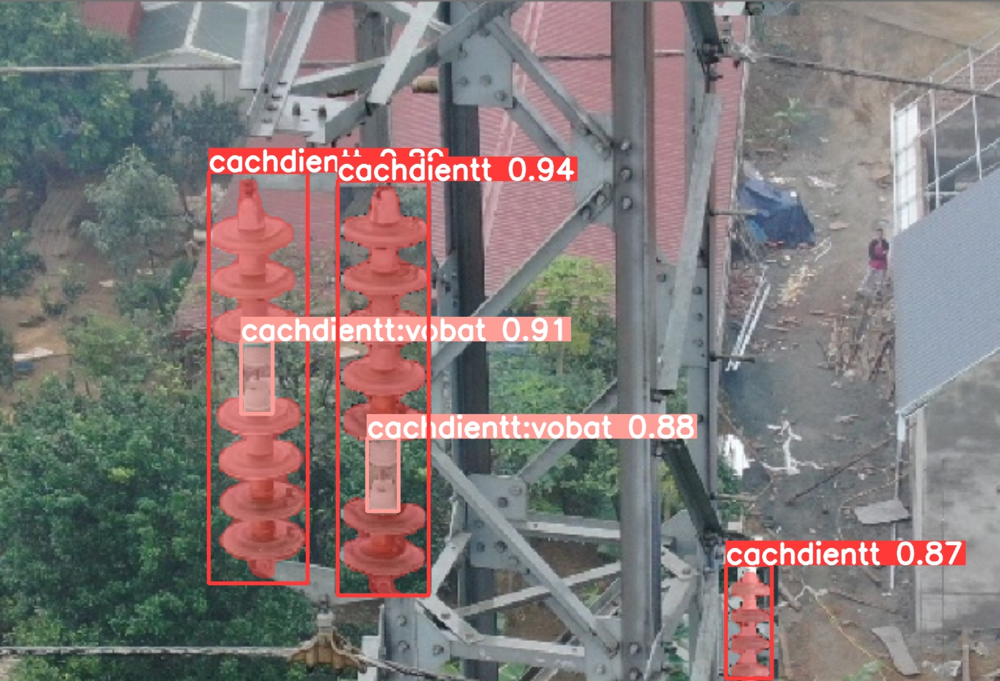
